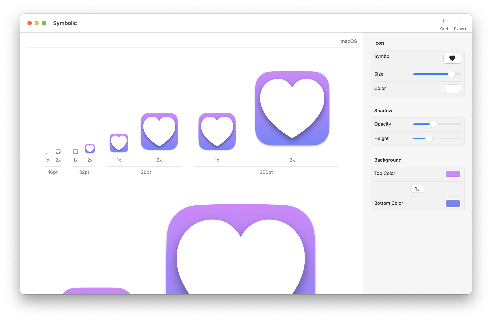

# Symbolic

[](https://github.com/inseven/symbolic/actions/workflows/build.yaml) [](https://github.com/inseven/symbolic/actions/workflows/update-release-notes.yaml) [](https://github.com/inseven/symbolic/actions/workflows/pages/pages-build-deployment)

Icon designer



## Development

Symbolic follows the version numbering, build and signing conventions for InSeven Limited apps. Further details can be found [here](https://github.com/inseven/build-documentation).

## Symbols

### Material Icons

Symbolic includes [Google Material Icons](https://fonts.google.com/icons) which are licensed under the [Apache License](https://www.apache.org/licenses/LICENSE-2.0.html).

Instead of using a submodule, they have been imported into the project using `scripts/import-material-design-icons.py` as the Material Icons repository is about 16GB and including this would significantly impact checkout and build times.

Update the icons as follows:

```bash
scripts/import-material-design-icons.py ~/Projects/material-design-icons
```

## Licensing

Symbolic is licensed under the BSD 3-Clause license modified by the Commons Clause (see [LICENSE](LICENSE)). It contains third-party code under other licenses, details of which can be found in the relevant directories and source file headers.

The intent behind using the Commons Clause is to protect Symbolic as a revenue source while also encouraging code sharing and reuse. If this prevents you from making use of the source in a way that aligns with this intent, please reach out and we can explore alternative approaches. If there are specific pieces of functionality you would like to reuse, please let me know; I am open to moving these into more permissively licensed libraries.
