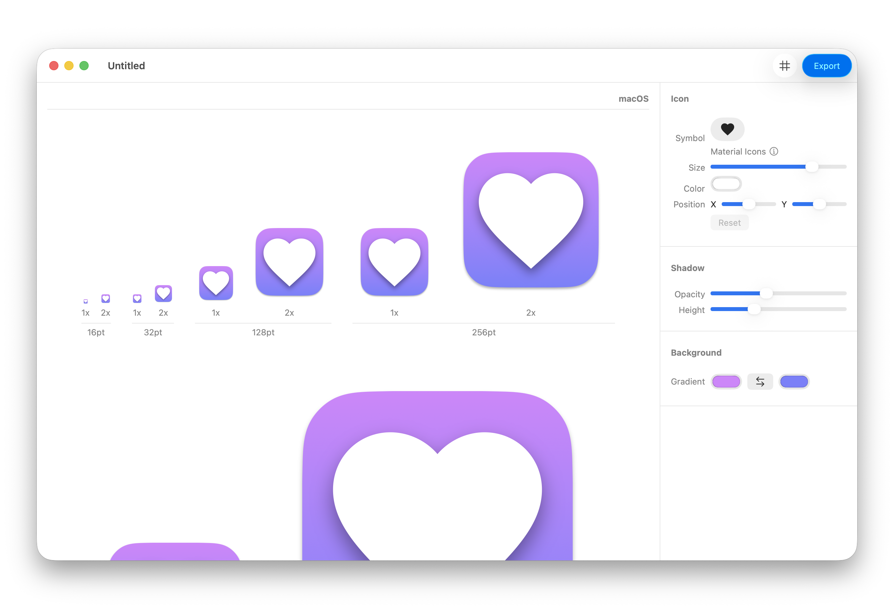

# Symbolic

[](https://github.com/inseven/symbolic/actions/workflows/build.yaml)

Icon designer



## Development

Symbolic follows the version numbering, build and signing conventions for InSeven Limited apps. Further details can be found [here](https://github.com/inseven/build-documentation).

## Symbols

### SF Symbols

Symbolic includes the full set of [SF Symbols](https://developer.apple.com/sf-symbols/). Like the Material Icons, they are loaded at runtime from a generated `manifest.json` (in `apple/Symbolic/Resources/sf-symbols`). The manifest is generated from the `CoreGlyphs` bundle that ships with macOS—the same data source that backs `Image(systemName:)`—so running the import on the latest version of macOS picks up the complete, up-to-date symbol set.

Update the symbols as follows:

```bash
scripts/import-sf-symbols.py
```

### Material Icons

Symbolic includes [Google Material Icons](https://fonts.google.com/icons) which are licensed under the [Apache License](https://www.apache.org/licenses/LICENSE-2.0.html).

Instead of using a submodule, they have been imported into the project using `scripts/import-material-design-icons.py` as the Material Icons repository is about 16GB and including this would significantly impact checkout and build times.

Update the icons as follows:

```bash
scripts/import-material-design-icons.py ~/Projects/material-design-icons
```

## License

Symbolic is licensed under the MIT License (see [LICENSE](LICENSE)). It depends on the following separately licensed third-party libraries and components:

- [Diligence](https://github.com/inseven/diligence), MIT License
- [Glitter](https://github.com/inseven/glitter), MIT License
- [Interact](https://github.com/inseven/interact), MIT License
- [Licensable](https://github.com/inseven/licensable), MIT License
- [Material Icons](https://github.com/google/material-design-icons), Apache License
- [Sparkle](https://github.com/sparkle-project/Sparkle), Sparkle License
- [SwiftDraw](https://github.com/swhitty/SwiftDraw), zlib License
