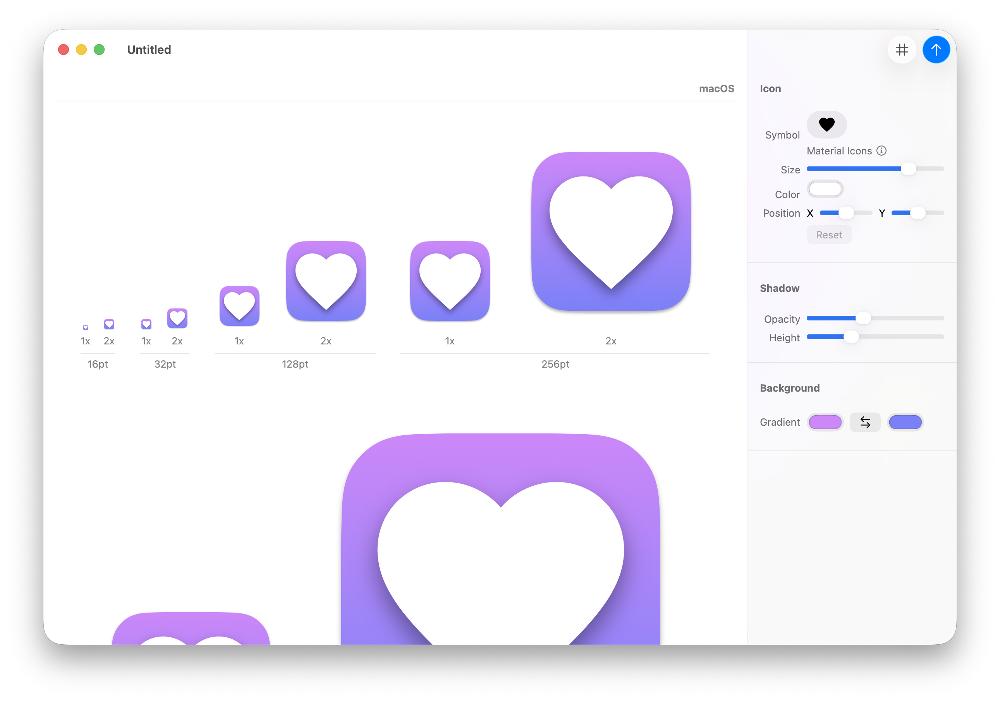

# Symbolic

[](https://github.com/inseven/symbolic/actions/workflows/build.yaml)

Icon designer



## Development

Symbolic follows the version numbering, build and signing conventions for InSeven Limited apps. Further details can be found [here](https://github.com/inseven/build-documentation).

## Symbols

### Material Icons

Symbolic includes [Google Material Icons](https://fonts.google.com/icons) which are licensed under the [Apache License](https://www.apache.org/licenses/LICENSE-2.0.html).

Instead of using a submodule, they have been imported into the project using `scripts/import-material-design-icons.py` as the Material Icons repository is about 16GB and including this would significantly impact checkout and build times.

Update the icons as follows:

```bash
scripts/import-material-design-icons.py ~/Projects/material-design-icons
```

## License

Symbolic is licensed under the MIT License (see [LICENSE](LICENSE)). It depends on the following separately licensed third-party libraries and components:

- [Diligence](https://github.com/inseven/diligence), MIT License
- [Interact](https://github.com/inseven/interact), MIT License
- [Licensable](https://github.com/inseven/licensable), MIT License
- [Material Icons](https://github.com/google/material-design-icons), Apache License
- [SwiftDraw](https://github.com/swhitty/SwiftDraw), zlib License
